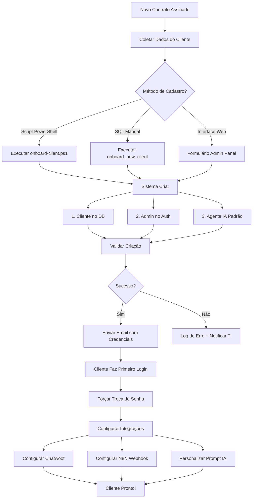

# 🚀 Processo de Onboarding de Novos Clientes

## 📋 Visão Geral

Este documento descreve o processo completo de cadastro e configuração de novos clientes no sistema SaaS Multi-Tenant.

## 🎯 O Que é Criado no Onboarding

Para cada novo cliente, o sistema cria automaticamente:

1. **Cliente** (tabela `clients`)
   - Registro do cliente com ID único
   - Nome comercial
   - Status ativo

2. **Usuário Admin** (tabelas `auth.users` + `dashboard_users`)
   - Conta de acesso ao dashboard
   - Permissões de administrador do cliente
   - Credenciais de login

3. **Agente IA Padrão** (tabela `agents`)
   - Assistente virtual básico
   - Prompt do sistema configurável
   - Pronto para receber conversas

## 🔧 Métodos de Onboarding

### Método 1: Script PowerShell Automatizado (Recomendado)

```powershell
.\onboard-client.ps1 `
    -ClientId "clinica_exemplo_001" `
    -ClientName "Clínica Exemplo Ltda" `
    -AdminEmail "admin@clinica.com.br" `
    -AdminName "Dr. João Silva" `
    -AdminPassword "Senha123!" `
    -AgentName "Assistente da Clínica" `
    -SystemPrompt "Você é o assistente virtual da Clínica Exemplo..."
```

**O que o script faz:**
1. ✅ Cria cliente no banco de dados
2. ✅ Cria registro do admin em `dashboard_users`
3. ✅ Cria usuário no Supabase Auth
4. ✅ Cria agente IA com prompt padrão
5. ✅ Sincroniza IDs entre Auth e Database
6. ✅ Valida toda a configuração
7. ✅ Exibe credenciais e próximos passos

**Quando usar:**
- Onboarding em massa
- Processo padronizado
- Ambiente de produção

### Método 2: Função SQL Direta

```sql
-- Onboarding completo via SQL
SELECT onboard_new_client(
    'clinica_exemplo_002',                     -- Client ID
    'Outra Clínica Ltda',                      -- Nome do cliente
    'contato@outraclinica.com.br',             -- Email admin
    'Dra. Maria Santos',                       -- Nome admin
    'Recepcionista Virtual',                   -- Nome do agente
    'Você é a recepcionista da clínica...'     -- System prompt
);
```

**Quando usar:**
- Testes rápidos
- Troubleshooting
- Ambiente de desenvolvimento

### Método 3: Interface Admin (Futuro - Prompt 4)

Interface web em `/admin` com formulário de cadastro:
- Dados do cliente
- Dados do administrador
- Configuração inicial do agente
- Preview antes de criar

**Status:** A ser implementado no Prompt 4

## 📝 Informações Necessárias para Cadastro

### Dados Obrigatórios

| Campo | Tipo | Exemplo | Descrição |
|-------|------|---------|-----------|
| **Client ID** | String (único) | `clinica_sorriso_002` | Identificador único do cliente |
| **Client Name** | String | `Clínica Sorriso Ltda` | Nome comercial |
| **Admin Email** | Email (único) | `admin@clinica.com.br` | Email de login |
| **Admin Name** | String | `Dr. João Silva` | Nome completo do administrador |

### Dados Opcionais

| Campo | Padrão | Descrição |
|-------|--------|-----------|
| **Admin Password** | `TempPass123!` | Senha temporária (deve ser trocada no 1º login) |
| **Agent Name** | `Assistente Virtual` | Nome do bot IA |
| **System Prompt** | Prompt genérico | Instruções para o comportamento da IA |

## 🔐 Gestão de Senhas

### Senha Temporária (Onboarding)

- Senha padrão: `TempPass123!` (ou definida no script)
- **OBRIGATÓRIO:** Cliente deve trocar no primeiro login
- Validade: Sem expiração automática (mas recomenda-se troca imediata)

### Troca de Senha pelo Usuário

#### Via Dashboard (Recomendado)

```javascript
// No componente React do dashboard
const handleChangePassword = async (newPassword) => {
  const { error } = await supabase.auth.updateUser({
    password: newPassword
  });
  
  if (error) {
    console.error('Erro ao trocar senha:', error);
    return;
  }
  
  alert('Senha alterada com sucesso!');
};
```

#### Via SQL (Admin)

```sql
-- Super admin pode resetar senha de qualquer usuário
-- Use via Supabase Auth Admin API
```

### Reset de Senha (Esqueci minha senha)

```javascript
// Enviar email de reset
const { error } = await supabase.auth.resetPasswordForEmail(
  'usuario@email.com',
  { redirectTo: 'https://seu-app.com/reset-password' }
);
```

## 🔄 Fluxo Completo de Onboarding



## 🛠️ Configurações Pós-Onboarding

### 1. Integração Chatwoot

```bash
# 1. Criar inbox no Chatwoot
.\create-chatwoot-inbox.ps1 -ClientId "clinica_exemplo_001"

# 2. Configurar webhook
.\configure-chatwoot-webhook.ps1 -ClientId "clinica_exemplo_001"

# 3. Atualizar agent com inbox_id
UPDATE agents 
SET chatwoot_inbox_id = 12345
WHERE client_id = 'clinica_exemplo_001';
```

### 2. Webhook N8N

```bash
# Configurar endpoint do workflow
UPDATE webhook_configs
SET 
    webhook_url = 'https://seu-n8n.app/webhook/wf0-chatwoot',
    is_active = true
WHERE client_id = 'clinica_exemplo_001';
```

### 3. Personalização do Prompt

```sql
-- Atualizar prompt do sistema
UPDATE ai_prompts
SET 
    system_prompt = 'Você é o assistente virtual da Clínica Exemplo.
Suas principais funções são:
- Agendar consultas
- Responder dúvidas sobre procedimentos
- Fornecer informações de contato
- Ser sempre educado e profissional',
    updated_at = NOW()
WHERE client_id = 'clinica_exemplo_001';
```

## 📊 Validação e Testes

### Checklist Pós-Onboarding

- [ ] Cliente aparece em `get_all_clients()`
- [ ] Admin consegue fazer login no dashboard
- [ ] Dashboard carrega métricas (mesmo que zeradas)
- [ ] Agente IA aparece na lista
- [ ] Inbox Chatwoot criado e vinculado
- [ ] Webhook N8N configurado e ativo
- [ ] Prompt personalizado configurado
- [ ] Teste end-to-end: enviar mensagem → IA responde

### Script de Validação

```powershell
# Validar onboarding completo
.\validate-client-setup.ps1 -ClientId "clinica_exemplo_001"
```

## 🚨 Troubleshooting

### Problema: Email já existe

```
Error: Usuário já existe com este email
```

**Solução:** Verificar se o email já foi usado em outro cliente. Se necessário, usar email alternativo ou deletar o usuário antigo.

### Problema: Client ID duplicado

```
Error: Cliente já existe com este ID
```

**Solução:** Escolher outro Client ID único. Padrão recomendado: `{nome}_{numero}`

### Problema: IDs não sincronizam

```
Warning: IDs diferentes (Dashboard vs Auth)
```

**Solução:** O script automaticamente sincroniza. Se manual, executar:

```sql
-- Atualizar ID do dashboard_users
UPDATE dashboard_users
SET id = '{auth_user_id}'
WHERE email = 'admin@cliente.com.br';
```

### Problema: Usuário criado mas não consegue logar

**Checklist:**
1. Email confirmado no Auth? (`email_confirmed_at` não nulo)
2. Senha correta?
3. Registro existe em `dashboard_users` com mesmo ID?
4. RLS policies permitem acesso?

## 📧 Template de Email para Novo Cliente

```
Assunto: Bem-vindo ao Sistema Multi-Channel Dashboard

Olá {AdminName},

Seu acesso ao Multi-Channel Dashboard foi criado com sucesso!

CREDENCIAIS DE ACESSO:
URL: https://seu-dashboard.app
Email: {AdminEmail}
Senha Temporária: {TempPassword}

PRIMEIRO ACESSO:
1. Acesse o link acima
2. Faça login com as credenciais fornecidas
3. IMPORTANTE: Troque sua senha imediatamente
4. Configure seu perfil

PRÓXIMOS PASSOS:
- Personalize o prompt do assistente virtual
- Configure integrações (WhatsApp, Instagram, etc)
- Adicione outros usuários da sua equipe

Dúvidas? Entre em contato: suporte@evolutedigital.com.br

Atenciosamente,
Equipe Evolute Digital
```

## 🔐 Segurança

### Boas Práticas

1. **Senhas Temporárias:**
   - Sempre usar senha forte temporária
   - Forçar troca no primeiro login
   - Nunca enviar senha por canais inseguros

2. **Validação de Email:**
   - Emails devem ser confirmados
   - Implementar verificação por link

3. **Logs de Auditoria:**
   - Registrar criação de clientes
   - Registrar primeiro login
   - Registrar troca de senha

4. **Permissões:**
   - Apenas super_admin pode criar clientes
   - RLS policies restringem acesso por client_id
   - Usuário só vê dados do próprio cliente

## 📈 Métricas de Onboarding

Acompanhar no Painel Admin:

- Total de clientes ativos
- Clientes cadastrados por mês
- Tempo médio de onboarding
- Taxa de sucesso no primeiro login
- Clientes com integrações completas

---

## 💡 Dicas Finais

1. **Padronize Client IDs:** Use padrão consistente (`{nome}_{numero}`)
2. **Documente Personalizações:** Cada cliente pode ter necessidades únicas
3. **Automatize o Máximo Possível:** Use o script PowerShell
4. **Valide Antes de Entregar:** Execute checklist completo
5. **Mantenha Logs:** Registre todo o processo de onboarding

---

**Última atualização:** 20/11/2025  
**Versão:** 1.0  
**Responsável:** Victor Castro (victor@evolutedigital.com.br)
