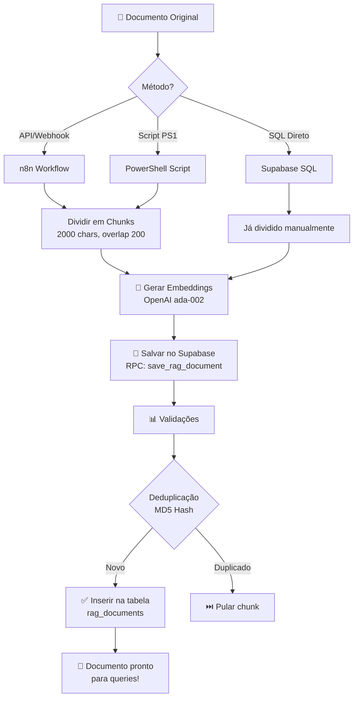

# 📚 GUIA PRÁTICO: Como Alimentar o RAG

## 🎯 Visão Geral

Existem **3 métodos** para alimentar documentos no sistema RAG. Escolha o método mais adequado para cada caso de uso.

---

## 🔄 MÉTODO 1: Via Webhook/API (Produção)

### **Quando usar:**
- ✅ Integração com aplicações externas
- ✅ Upload automático de documentos
- ✅ Sincronização com Google Drive, Dropbox, etc.
- ✅ Interface web para clientes

### **Passo 1: Importar Workflow**

1. Abra n8n: https://n8n.evolutedigital.com.br
2. Clique em **Workflows → Import from File**
3. Selecione: `workflows/RAG-INGESTION-WORKFLOW.json`
4. Configure credenciais:
   - OpenAI API Key
   - Supabase API Key
5. **Ative o workflow**
6. Copie a URL do webhook (algo como: `https://n8n.../webhook/rag-upload`)

### **Passo 2: Enviar Documentos**

#### **Opção A: Texto direto**

```bash
curl -X POST https://n8n.evolutedigital.com.br/webhook/rag-upload \
  -H "Content-Type: application/json" \
  -d '{
    "client_id": "clinica_sorriso_001",
    "agent_id": "default",
    "content": "Horário de funcionamento:\nSegunda a Sexta: 8h às 18h\nSábado: 8h às 12h",
    "file_name": "horario-atendimento.txt",
    "document_type": "manual",
    "metadata": {
      "tags": ["horário", "atendimento"],
      "categoria": "informações_básicas"
    }
  }'
```

#### **Opção B: Upload de PDF via URL**

```bash
curl -X POST https://n8n.evolutedigital.com.br/webhook/rag-upload \
  -H "Content-Type: application/json" \
  -d '{
    "client_id": "clinica_sorriso_001",
    "agent_id": "default",
    "document_url": "https://site.com/catalogo-servicos.pdf",
    "file_name": "catalogo-servicos.pdf",
    "document_type": "pdf",
    "metadata": {
      "tags": ["catálogo", "preços"],
      "ano": "2025"
    }
  }'
```

#### **Opção C: Upload de página web**

```bash
curl -X POST https://n8n.evolutedigital.com.br/webhook/rag-upload \
  -H "Content-Type: application/json" \
  -d '{
    "client_id": "clinica_sorriso_001",
    "agent_id": "default",
    "document_url": "https://clinica.com/servicos",
    "file_name": "pagina-servicos.txt",
    "document_type": "url"
  }'
```

### **Resposta esperada:**

```json
{
  "success": true,
  "chunks_uploaded": 5,
  "chunks_failed": 0,
  "document_id": "b043b217-8ac2-4077-a208-33877d8b2232",
  "total_cost": "$0.00005",
  "client_id": "clinica_sorriso_001",
  "agent_id": "default"
}
```

---

## 💻 MÉTODO 2: Via Script PowerShell (Admin)

### **Quando usar:**
- ✅ Upload manual de documentos
- ✅ Testes e desenvolvimento
- ✅ Upload em lote de múltiplos arquivos
- ✅ Administração do sistema

### **Configuração inicial:**

```powershell
# Definir variáveis de ambiente (executar 1x)
$env:SUPABASE_SERVICE_ROLE_KEY = "eyJhbGciOiJIUzI1NiIsInR5cCI6IkpXVCJ9..."
$env:OPENAI_API_KEY = "sk-proj-..."
```

### **Uso do script:**

#### **Opção 1: Upload de arquivo único**

```powershell
# Fazer upload de 1 arquivo
.\upload-documento-rag.ps1 -FilePath "C:\Docs\manual-servicos.txt" -ClientId "clinica_sorriso_001"
```

#### **Opção 2: Digitar conteúdo manualmente**

```powershell
# Executar sem parâmetros para menu interativo
.\upload-documento-rag.ps1

# Escolher opção 2
# Digitar conteúdo
# Pressionar Ctrl+Z e Enter para finalizar
```

#### **Opção 3: Upload em lote de pasta**

```powershell
# Fazer upload de TODOS os arquivos TXT/MD de uma pasta
.\upload-documento-rag.ps1

# Escolher opção 3
# Digitar caminho: C:\Documentos\Base_Conhecimento
# Confirmar com "S"
```

**O script faz automaticamente:**
- ✅ Divide texto em chunks (2000 chars)
- ✅ Gera embeddings OpenAI
- ✅ Salva no Supabase com isolamento multi-tenant
- ✅ Mostra progresso e custos
- ✅ Retorna resumo de sucesso/erros

---

## 🗄️ MÉTODO 3: Via SQL Direto (Avançado)

### **Quando usar:**
- ⚠️ Casos especiais apenas
- ⚠️ Migração de dados existentes
- ⚠️ Debugging/troubleshooting

### **Exemplo:**

```sql
-- 1. Gerar embedding externamente (OpenAI API)
-- 2. Inserir manualmente:

SELECT save_rag_document(
  p_client_id := 'clinica_sorriso_001',
  p_agent_id := 'default',
  p_content := 'Conteúdo do documento aqui...',
  p_content_hash := md5('Conteúdo do documento aqui...'),
  p_embedding := '[0.123, -0.456, 0.789, ...]'::vector(1536),
  p_metadata := '{"tags": ["manual"]}'::jsonb,
  p_source_type := 'manual',
  p_source_id := 'manual-001',
  p_source_url := NULL,
  p_file_name := 'documento.txt',
  p_chunk_index := 0,
  p_total_chunks := 1
);
```

---

## 📊 Fluxo Completo de Alimentação



---

## 🎬 Exemplo Completo: Clínica Odontológica

### **Cenário:**
Uma clínica precisa alimentar o RAG com:
- Manual de serviços (PDF)
- Tabela de preços (TXT)
- Política de cancelamento (MD)
- Perguntas frequentes (web scraping)

### **Passo a passo:**

#### **1. Upload do PDF (via webhook)**

```bash
curl -X POST https://n8n.evolutedigital.com.br/webhook/rag-upload \
  -H "Content-Type: application/json" \
  -d '{
    "client_id": "clinica_sorriso_001",
    "agent_id": "default",
    "document_url": "https://storage.clinica.com/manual-servicos.pdf",
    "file_name": "manual-servicos.pdf",
    "document_type": "pdf",
    "metadata": {"tags": ["serviços", "procedimentos"], "versao": "2025-01"}
  }'
```

#### **2. Upload da tabela de preços (via script)**

```powershell
# Criar arquivo: precos-2025.txt
@"
TABELA DE PREÇOS 2025

CONSULTAS E AVALIAÇÕES:
- Consulta inicial: R$ 150,00
- Retorno (até 30 dias): Gratuito
- Avaliação ortodôntica: R$ 200,00

PROCEDIMENTOS BÁSICOS:
- Limpeza completa: R$ 200,00
- Aplicação de flúor: R$ 80,00
- Tratamento de canal: R$ 800,00 a R$ 1.500,00

ESTÉTICA:
- Clareamento a laser: R$ 800,00
- Faceta de resina: R$ 400,00 por dente
- Faceta de porcelana: R$ 2.000,00 por dente

PRÓTESES:
- Coroa provisória: R$ 300,00
- Coroa definitiva: R$ 1.200,00
- Ponte fixa: R$ 3.000,00 (3 elementos)

URGÊNCIAS:
- Atendimento de emergência: R$ 250,00
- Final de semana/feriado: R$ 350,00

FORMAS DE PAGAMENTO:
- À vista: 10% desconto
- Cartão de crédito: até 6x sem juros
- Parcelamento próprio: até 12x (consultar condições)
"@ | Out-File -FilePath "precos-2025.txt" -Encoding UTF8

# Upload via script
.\upload-documento-rag.ps1 -FilePath "precos-2025.txt" -ClientId "clinica_sorriso_001"
```

#### **3. Upload da política de cancelamento (via script)**

```powershell
# Criar arquivo: politica-cancelamento.md
@"
# POLÍTICA DE CANCELAMENTO E REMARCAÇÃO

## Cancelamento de Consultas

- **Até 24 horas de antecedência**: Cancelamento gratuito
- **Entre 12 e 24 horas**: Taxa de R$ 50,00
- **Menos de 12 horas**: Cobrança integral da consulta (R$ 150,00)
- **Não comparecimento (no-show)**: Cobrança integral + bloqueio temporário

## Remarcação

- Permitido remarcar **até 2 vezes** sem custo adicional
- Deve ser feito com **pelo menos 24 horas** de antecedência
- Terceira remarcação: taxa de R$ 30,00

## Procedimentos Agendados

- Cancelamento até **48 horas** antes: sem custo
- Menos de 48 horas: 30% do valor do procedimento
- Procedimentos complexos (canal, prótese): 50% do valor

## Exceções

- Emergências médicas (com comprovante)
- Casos de força maior (avaliados individualmente)
- Pacientes em tratamento contínuo: política especial

## Como Cancelar/Remarcar

- WhatsApp: (11) 98765-4321
- Telefone: (11) 3456-7890
- E-mail: atendimento@clinicasorriso.com
- Horário: Segunda a Sexta, 8h às 18h
"@ | Out-File -FilePath "politica-cancelamento.md" -Encoding UTF8

# Upload
.\upload-documento-rag.ps1 -FilePath "politica-cancelamento.md" -ClientId "clinica_sorriso_001"
```

#### **4. Verificar estatísticas**

```sql
-- Abrir SQL Editor do Supabase e executar:

SELECT * FROM rag_statistics
WHERE client_id = 'clinica_sorriso_001'
  AND agent_id = 'default';

-- Resultado esperado:
-- total_documents: 15
-- unique_sources: 3
-- avg_chunk_size: ~1500
-- first_upload: 2025-11-16
-- last_upload: 2025-11-16
```

#### **5. Testar via Chatwoot**

Agora envie mensagens no Chatwoot para testar o RAG:

- **Pergunta 1**: "Quanto custa um clareamento dental?"
  - ✅ RAG deve retornar: "R$ 800,00" (do arquivo precos-2025.txt)

- **Pergunta 2**: "Posso cancelar minha consulta de amanhã?"
  - ✅ RAG deve retornar: política de 24h de antecedência

- **Pergunta 3**: "Quais formas de pagamento vocês aceitam?"
  - ✅ RAG deve retornar: à vista, cartão, parcelamento

---

## ⚙️ Configurações Avançadas

### **Ajustar tamanho dos chunks**

Edite o workflow `RAG-INGESTION-WORKFLOW.json`:

```javascript
// Node: "Dividir em Chunks"
const chunkSize = 2000;      // Padrão: 2000
const overlap = 200;         // Padrão: 200

// Para documentos técnicos: aumentar
const chunkSize = 3000;
const overlap = 300;

// Para mensagens curtas: reduzir
const chunkSize = 1000;
const overlap = 100;
```

### **Adicionar pré-processamento**

```javascript
// Node customizado antes do chunking
let content = $input.item.json.content;

// Remover cabeçalhos/rodapés
content = content.replace(/Página \d+ de \d+/g, '');

// Normalizar espaços
content = content.replace(/\s+/g, ' ').trim();

// Remover URLs (se não forem importantes)
content = content.replace(/https?:\/\/[^\s]+/g, '');

return { json: { content } };
```

### **Implementar versionamento**

```json
{
  "metadata": {
    "tags": ["preços"],
    "versao": "2025-01",
    "substituir": "preços-2024"
  }
}
```

Adicione lógica no workflow para deletar versão antiga:

```javascript
// Antes de fazer upload da nova versão
if (metadata.substituir) {
  // Chamar RPC para deletar documentos antigos
  await supabase.rpc('delete_rag_documents_by_source', {
    p_client_id: clientId,
    p_agent_id: agentId,
    p_source_id: metadata.substituir
  });
}
```

---

## 💰 Estimativa de Custos

### **Por documento:**

| Tamanho | Chunks | Embeddings | Custo |
|---------|--------|------------|-------|
| 1.000 chars | 1 | 1x | $0.00001 |
| 10.000 chars | 5 | 5x | $0.00005 |
| 100.000 chars | 50 | 50x | $0.0005 |
| 1.000.000 chars (1 MB) | 500 | 500x | $0.005 |

### **Exemplo real (clínica):**

```
3 documentos totalizando 50.000 caracteres:
- Manual serviços: 20.000 chars → 10 chunks
- Tabela preços: 5.000 chars → 3 chunks
- Política: 25.000 chars → 13 chunks

Total: 26 embeddings × $0.00001 = $0.00026 (upload único)

Queries mensais (1000 mensagens × 30% usam RAG):
300 queries × $0.00001 = $0.003/mês

CUSTO TOTAL: ~$0.003/mês (desprezível!)
```

---

## 🚨 Troubleshooting

### **Problema 1: Webhook retorna erro 404**

```bash
# Verificar se workflow está ativo
# Abrir n8n → Workflows → verificar status "Active"
# Copiar URL novamente do nó Webhook
```

### **Problema 2: "relation rag_documents does not exist"**

```bash
# Migration 020 ainda não foi executada
# Executar:
.\run-migration-020-manual.ps1
```

### **Problema 3: Documento não aparece nas queries**

```sql
-- Verificar se foi inserido:
SELECT * FROM rag_documents
WHERE client_id = 'seu_client_id'
  AND agent_id = 'default'
ORDER BY created_at DESC
LIMIT 5;

-- Verificar similaridade manualmente:
SELECT 
  content,
  1 - (embedding <=> '[0.123, ...]'::vector(1536)) as similarity
FROM rag_documents
WHERE client_id = 'seu_client_id'
ORDER BY similarity DESC
LIMIT 3;
```

### **Problema 4: Custos muito altos**

```javascript
// Implementar cache de embeddings no n8n
// Adicionar nó Redis antes de chamar OpenAI:

const crypto = require('crypto');
const hash = crypto.createHash('sha256').update(content).digest('hex');
const cacheKey = `embedding:${hash}`;

// Check cache
const cached = await redis.get(cacheKey);
if (cached) {
  return JSON.parse(cached);
}

// Se não existir, gerar e salvar
const embedding = await openai.embeddings.create({...});
await redis.set(cacheKey, JSON.stringify(embedding), { EX: 2592000 }); // 30 dias
```

---

## ✅ Checklist Pós-Upload

Depois de fazer upload de documentos, verificar:

- [ ] Documentos aparecem na tabela `rag_documents`
- [ ] Estatísticas mostram contagem correta (`rag_statistics` view)
- [ ] Query de teste retorna documentos relevantes (similarity > 70%)
- [ ] Chatwoot mostra contexto RAG nas respostas do LLM
- [ ] Logs do n8n mostram "✅ RAG ativo! Formatando contexto..."
- [ ] Custo acumulado está dentro do esperado

---

## 🎯 Próximos Passos

Após dominar a alimentação básica:

1. **Implementar UI para clientes**
   - Interface web para upload de documentos
   - Listar documentos existentes
   - Deletar/atualizar documentos

2. **Auto-sincronização**
   - Integrar com Google Drive
   - Monitorar pasta e fazer upload automático
   - Webhook quando arquivo muda

3. **Processamento avançado**
   - OCR para imagens/PDFs escaneados
   - Extração de tabelas
   - Suporte para Excel/CSV

4. **Analytics**
   - Dashboard de uso do RAG
   - Documentos mais acessados
   - Queries sem resultados (gap analysis)

---

## 📚 Recursos

- **Workflow Ingestion**: `workflows/RAG-INGESTION-WORKFLOW.json`
- **Script Upload**: `upload-documento-rag.ps1`
- **Script Teste**: `testar-rag-completo.ps1`
- **Migration SQL**: `database/migrations/020_create_rag_system.sql`
- **Documentação completa**: `workflows/GUIA-IMPLEMENTACAO-RAG.md`

---

**Criado em:** 16/11/2025  
**Versão:** 1.0  
**Status:** ✅ Pronto para produção
